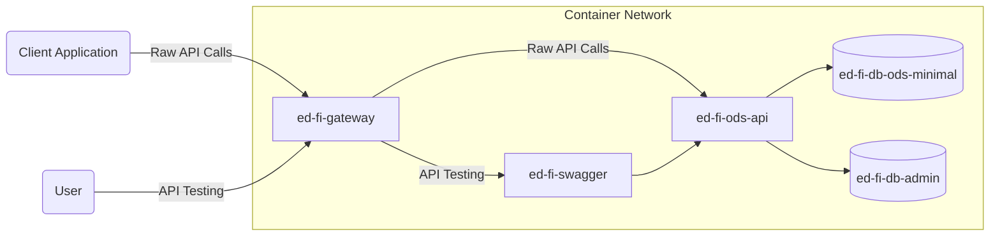
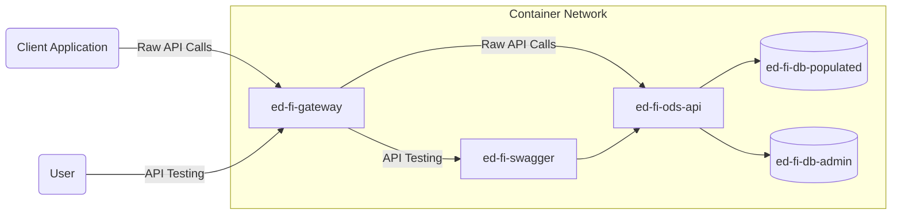

# Docker for the ODS/API Platform

## Overview

This directory contains dockerfiles and related scripts, as needed, for the
official binary release images of the ODS / API platform.

As appropriate, these images are built from the same NuGet packages that are
distributed as the "binary release" of the platform. This source repository also
includes dockerfiles that build from source code. These are intended for
end-to-end and local testing, not for distribution.

The [Ed-Fi-ODS-Docker](https://github.com/Ed-Fi-Alliance-OSS/Ed-Fi-ODS-Docker)
continues to hold more complex Docker Compose scripts that also demonstrate
loading tools from other repositories, and serve as a basis for potential
production releases.

## Docker Compose Files

There are two compose files provided for local testing: one that loads the
"minimal template" and another that loads the "populated template" version of
the ODS database.

> **Warning** these are not appropriate for production use!

Both compose files expect the presence of a `.env` file. You can copy
`.env.example` and customize it for both.

In both cases there are no credentials at startup. The script
[bootstrap.ps1](./bootstrap.ps1) creates a set of initial credentials with
access to all resources, using the `Ed-Fi Sandbox` claimset. It also creates a
self-signed TLS certificate.

* Key: `sampleKey`
* Secret: `sampleSecret`.

In a real production environment you would use Admin API or Admin App to create
these credentials.

### Minimal Template

The file [docker-compose-minimal.yml](./docker-compose-minimal.yml) starts up
the ODS/API with the minimal template database, which contains the default set
of Ed-Fi descriptors, and no other data.

Operational commands:

```pwsh
# (optional) Only build the images, don't start them 
docker compose -f docker-compose-minimal.yml build

# Start
docker compose -f docker-compose-minimal.yml up -d

# Stop
docker compose -f docker-compose-minimal.yml stop
```

Network topology:



### Populated Template

The file [docker-compose-populated.yml](./docker-compose-populated.yml) starts
up the ODS/API with the populated template database, which contains the default
set of Ed-Fi descriptors, and no other data.

Operational commands:

```pwsh
# (optional) Only build the images, don't start them 
docker compose -f docker-compose-populated.yml build

# Start
docker compose -f docker-compose-populated.yml up -d

# Stop
docker compose -f docker-compose-populated.yml stop
```

Network topology:

