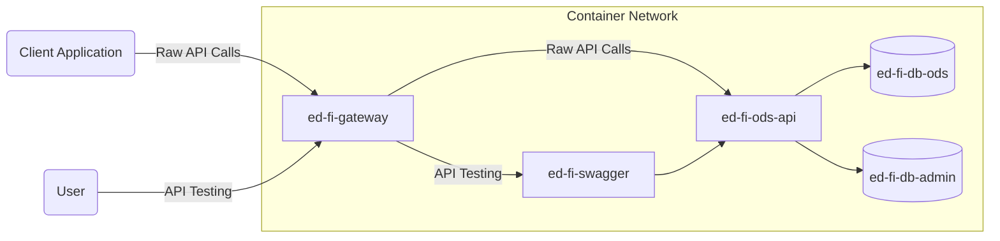
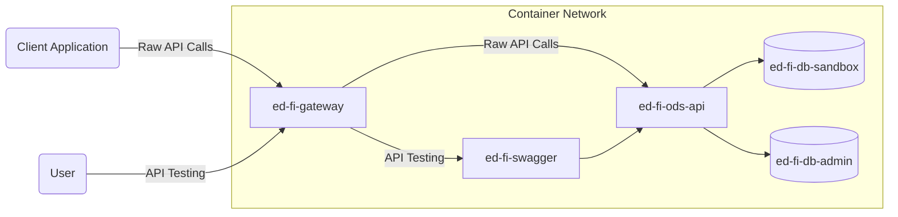

# Docker for the ODS/API Platform

## Overview

This directory contains dockerfiles and related scripts, as needed, for the
official binary release images of the ODS / API platform.

As appropriate, these images are built from the same NuGet packages that are
distributed as the "binary release" of the platform. This source repository also
includes dockerfiles that build from source code. These are intended for
end-to-end and local testing, not for distribution.

The [Ed-Fi-ODS-Docker](https://github.com/Ed-Fi-Alliance-OSS/Ed-Fi-ODS-Docker)
continues to hold more complex Docker Compose scripts that also demonstrate
loading tools from other repositories, and serve as a basis for potential
production releases.

## Docker Compose Files

There are two compose files provided for local testing.

> **Warning** these are not appropriate for production use!

Both compose files expect the presence of a `.env` file. You can copy
`.env.example` and customize it for both.

### Shared Instance

The file
[docker-compose-sharedinstance.yml](./docker-compose-sharedinstance.yml) starts
up the class "shared instance" ODS/API, with the minimal database template. Thus
the ODS database will have the default set of Ed-Fi descriptors, and no other
data.

This environment does not automatically create any credentials that could be
used in Swagger UI or by a client application. There is a convenience script
that starts the environment and injects credentials `minimalKey` /
`minimalSecret`: [bootstrap-shared.ps1](./bootstrap-shared.ps1).

Operational commands:

```pwsh
docker compose -f docker-compose-sharedinstsance.yml
```

Network topology:



### Sandbox

The file
[docker-compose-sharedinstance.yml](./docker-compose-sharedinstance.yml) starts
up the "sandbox" ODS/API, with both minimal and populated template ODS
databases. The populated template database includes a small set of sample data
such as fake schools and students.

This environment does not automatically create any credentials that could be
used in Swagger UI or by a client application. There is a convenience script
that starts the environment and injects credentials `minimalKey` /
`minimalSecret` and `populatedKey` / `populatedSecret`:
[bootstrap-sandbox.ps1](./bootstrap-sandbox.ps1).

Network topology:

